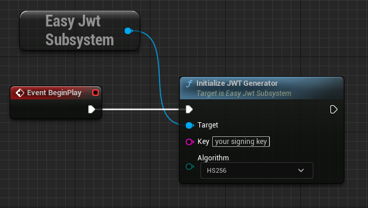
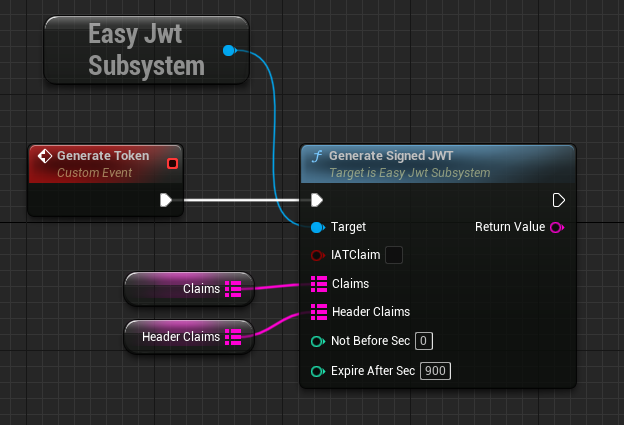
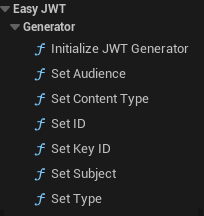
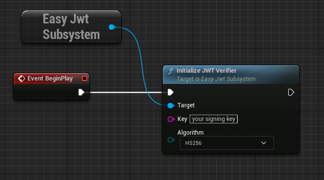
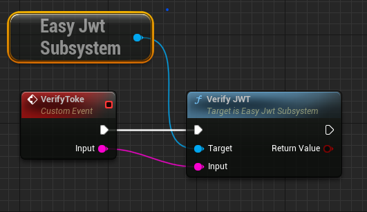
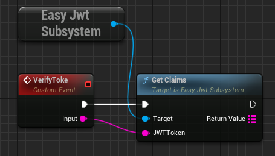
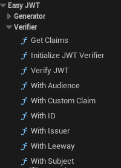

# Support this project by buying a license on [Unreal Marketplace](https://www.unrealengine.com/marketplace/en-US/product/easy-jwt). 

<h1 align="center">
  <br>
  <a href="https://discord.com/invite/MtGpAdM">
    
  </a>
  <br>
  Json Web Tokens for Unreal Engine 4/5
  <br>
</h1>

# EasyJwt subsystem

EasyJwt is a JSON web tokens engine sub-system for Unreal Engine 4/5, that provides a c++ and bluprint interface to Generate, Sign, Verify and manage claims of JWT.

# Supported Platforms

 - Windows x86_64
 - Hololens 2 (Windows ARM64)
 - Linux x86_64
 - Linux ARM64

# C++ Modules Link

Link the plugin modules to your project through `<YourModule>.build.cs`:

```cs
bEnableExceptions = true;//we are usingg exceptions

 PrivateDependencyModuleNames.AddRange( new string[]
{
    "JwtCpp",
    "JwtVerifier",
    "JwtGenerator"
});
```
# JWT Generator Basic Usage

## C++
Initialize the Generator

```cpp
#include "EasyJwtSubsystem.h"

TSharedPtr<FEasyJwtModule> EasyJwt = GEngine->GetEngineSubsystem<UEasyJwtSubsystem>()->Get();
EasyJwt->GetGenerator()->InitGenerator(`<SIGNING_KEY>`, EGeneratorAlgorithm::HS256);
```

Generate Signed Token Basic Example:

```cpp
#include "EasyJwtSubsystem.h"

TSharedPtr<FEasyJwtModule> EasyJwt = GEngine->GetEngineSubsystem<UEasyJwtSubsystem>()->Get();

TMap<FString, FString> Claims =
{
	{"Claim1","34235"},
	{"Claim2","dfgds"}
};

TMap<FString, FString> HeaderClaims =
{
	{"HeaderClaim1","345343"},
	{"HeaderClaim2","jhgfdrtt"}
};
/*
Valid since generating it and for 900sec with the givem claims.
*/
FString JwtToken = EasyJwt->GetGenerator()->GenerateJwtToken(true, 0, 900, Claims, HeaderClaims);
```
## Blueprint

Initialize the Generator



Generate Signed Toker



Blueprint API



# JWT Verifier Basic Usage

## C++
Initialize the Verifier

```cpp
#include "EasyJwtSubsystem.h"

TSharedPtr<FEasyJwtModule> EasyJwt = GEngine->GetEngineSubsystem<UEasyJwtSubsystem>()->Get();

EasyJwt->GetVerifier()->InitVerifier(`<SIGNING_KEY>`, EVerifierAlgorithm::HS256);
```

Verify a Token

```cpp
#include "EasyJwtSubsystem.h"

TSharedPtr<FEasyJwtModule> EasyJwt = GEngine->GetEngineSubsystem<UEasyJwtSubsystem>()->Get();

bool bValid = EasyJwt->GetVerifier()->VerifyJWT(`<TOKEN_TO_VERIFY>`);
```

Get Claims From JWT

```cpp
#include "EasyJwtSubsystem.h"

TSharedPtr<FEasyJwtModule> EasyJwt = GEngine->GetEngineSubsystem<UEasyJwtSubsystem>()->Get();

TMap<FString, FString> Claims = EasyJwt->GetVerifier()->GetClaims(`<JWT>`);
```

## Blueprint

Initialize the Verifier



Verify a Token



Extract Claims From a JWT



Blueprint API




## Supported Algorithms

 - HS256
 - HS348
 - HS512
 - RS256
 - RS384
 - RS512

More to come soon!!

## Find it helpful?

Give us a ⭐️!


